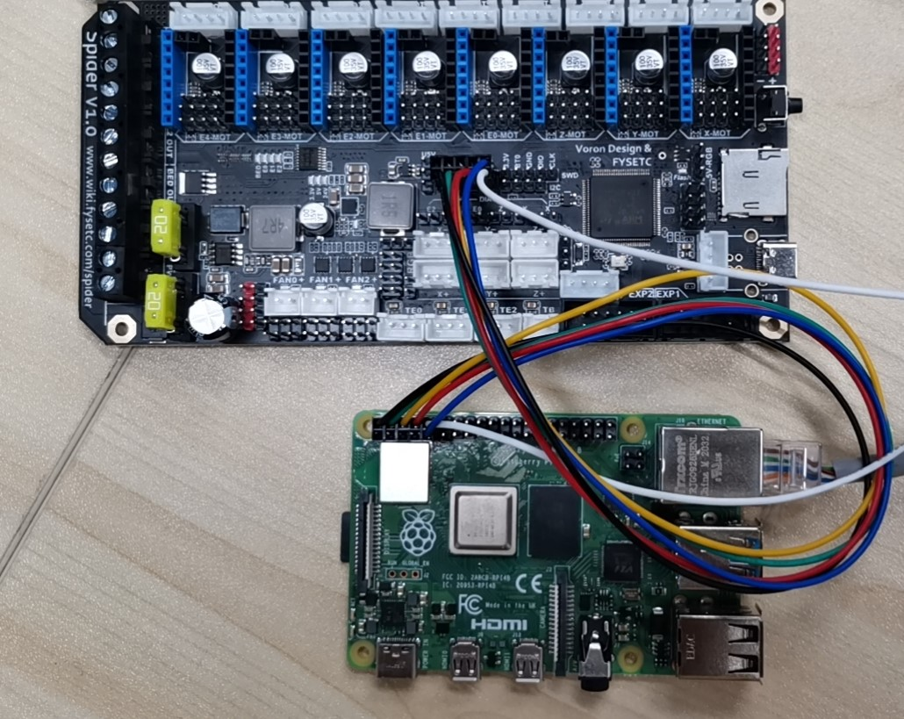

# Klipper

There are two firmwares for Spider board.

### 1 : Spider UART1 to RPI uart

If you connect Spider UART1(RX1:PA10, TX1:PA9) port to RPI  uart0(TX:GPIO14,RX:GPIO15) port, then klipper-UART0.bin is the firmware you need to flash into Spider board. And in printer.cfg which is the example cfg for VORON 2 machine in this repo you need to change the serial to

```
serial: /dev/ttyAMA0
```

And  you need to switch hardware uart to GPIO14/GPIO15. You need to edit the following line in /boot/config.txt file

```
sudo nano /boot/cmdline.txt
```

remove the word phase "console=serial0,115200" or "console=ttyAMA0,115200", then

```
sudo reboot
```

Then enter RPI system again.

```
sudo raspi-config
```

=> Interfacing Option

=> Serial

=> NO

=> YES

```
sudo nano /boot/config.txt
```

Add `dtoverlay=pi3-disable-bt` at the end of the file. Then reboot again.

```
sudo reboot
```

Done.

The main point to build klipper-UART0.bin is that you need to select `Communication interface` to `Serial (on USART1 PA10/PA9)` in `make menuconfig` when you compile Klipper.

We make a cable as below , and it have the power cable in it two, so you can power the RPI with it.



### 2 : USB type-c cable

If the communication between Spider board and RPI is on an USB type-C cable. Then klipper.bin is the firmware for you. And in printer.cfg you need to set the serial as below.
```
Obtain definition by "ls -l /dev/serial/by-id/" then unplug to verify
##--------------------------------------------------------------------
serial: /dev/serial/by-id/usb-Klipper_stm32f446xx_230032000851363131363530-if00
```

The main point to build klipper.bin is that you need to select `Communication interface` to `USB` in `make menuconfig` when you compile Klipper for Spider.