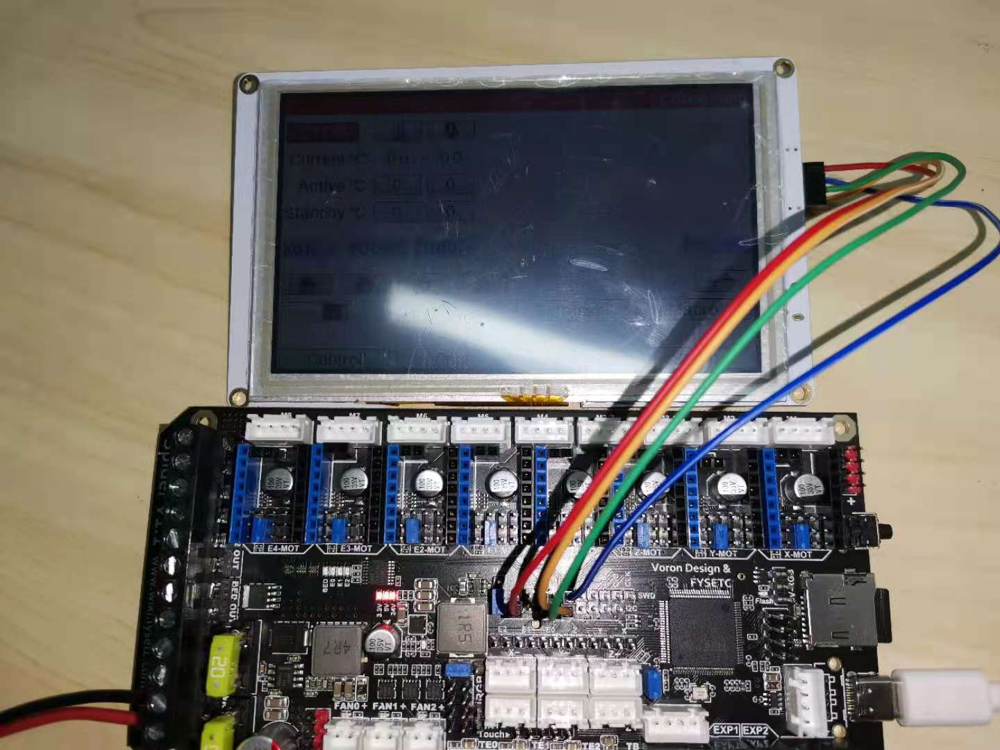
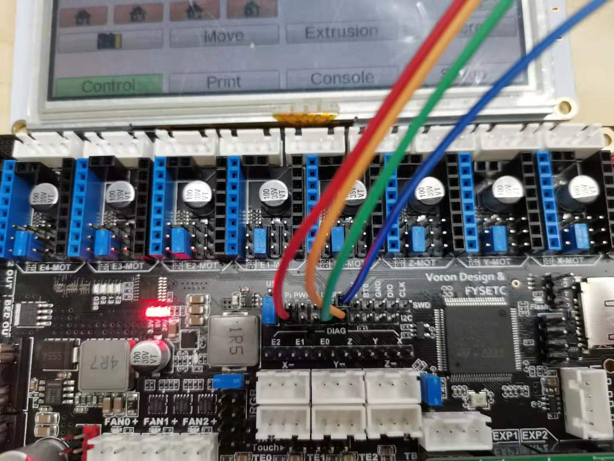
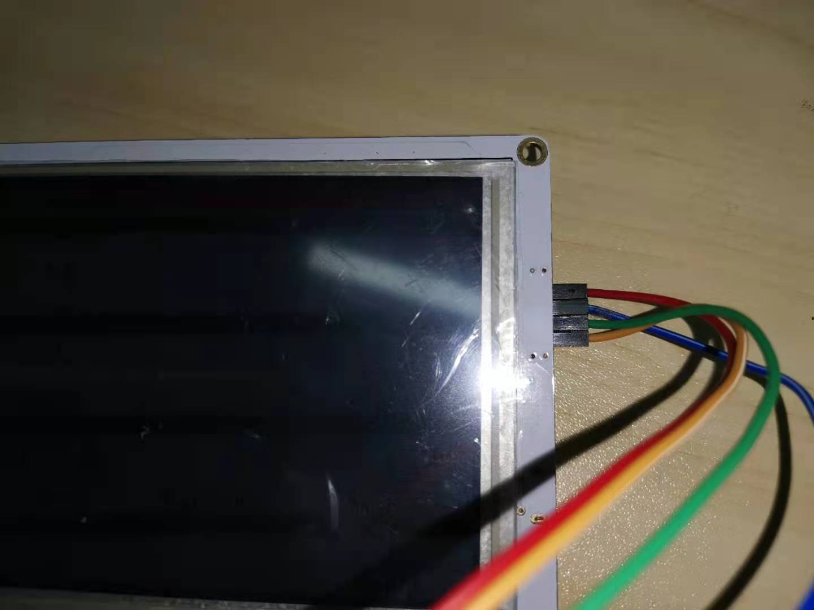
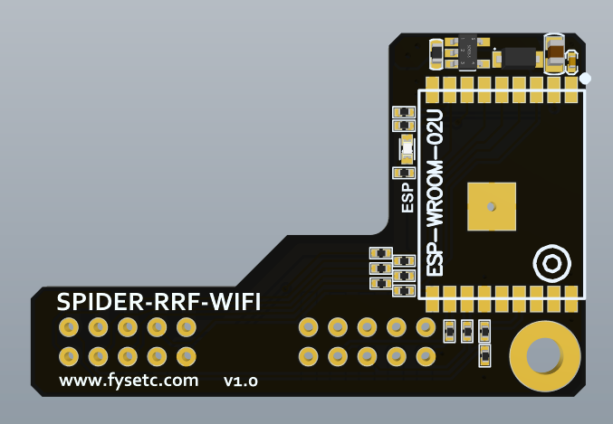
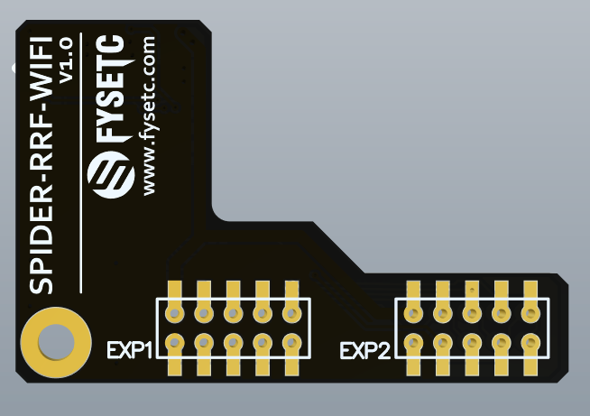

# Firmware

- ## Bootloader

Before you use this RRF firmware, you need to follow the README [here](https://github.com/FYSETC/FYSETC-SPIDER/tree/main/bootloader) to upload the bootloader `Bootloader_FYSETC_SPIDER.hex` first, boot offset is `32k` (`0x08008000`). 

- ## Firmware

This firmware is base on [gloomyandy/RRFBuild at v3.3-dev (github.com)](https://github.com/gloomyandy/RRFBuild/tree/v3.3-dev). The original firmware size is larger than 512k which exceed STM32F446 chip flash room. So i remove/disable some features. You can check what have been changed below. And there is `Patches` folder showing all the changes.

```
λ git log -16 --oneline
65fa2a9 (HEAD -> v3.3-dev) Add STM32F446 variants
4152f02 Disable HAS_VOLTAGE_MONITOR
2ad660c Remove NonVolatileMemory support
e1aa79e Disable HAS_CPU_TEMP_SENSOR
513cf9a Comment paneldue update function
c04cffd Remove Display src in RepRapFirmware.mk
f487869 Diable SUPPORT_12864_LCD
5352406 Remove other board config, reserve FYSETC Spider only
e164053 Update FYSETC.h pins file
c704df2 Change makefile for STM32F446
074dd9e Disable CCMRAM
bc512a5 Add RepRapFirmware
ffd77a2 Add RRFLibraries
c3bf369 Add DuetWiFiSocketServer
0fa2d23 Add FreeRTOS
7b49883 Add CoreN2G
```

- ## Pre-builds

This folder contains a firmware named `firmware.bin` , boot offset is `32k` (`0x08008000`), you can start RRF by flashing this firmware to have a try.

- # config

There is `config` folder beside this README file, it is just an example config to run RRF. Copy all contents in the `config` folder to your sdcard root directory and insert the sdcard to Spider sdcard slot. You need to know this is just example for you to try RRF, it not for VORON or any machines. And if you make the right config for VORON, please make a PR for me, i will update it ASAP, thanks in advance. 

# Hardware

If you want to build a machine with this RRF firmware on Spider, then you have three ways to communicate with/control Spider.

## 1.USB serial

After you flash bootloader and firmware, and insert the sdcard with example config(i really recommend you to make the config yourself), you should get information from USB serial now(Of course, you need a USB cable to connect Spider to your PC). So you can control the motherboard using RRF [gcode](https://duet3d.dozuki.com/Wiki/Gcode) now.

## 2.Paneldue

Control the machine with USB serial will be a hard job, so you may need a screen to make the work easier. And i remove other lcd support in this firmware, so i recommend you to use Paneldue, you can get it from our store [here](https://www.aliexpress.com/item/4000156345741.html). You can connect it to Spider using the wiring below.





## 3.Wifi module

RRF in Spider also support wifi module. You can get the module [here](https://www.aliexpress.com/item/1005003145645569.html). You can follow below steps to connect it to your wifi network.

1. Stop wifi module

   ```
   M552 s-1
   ```

   You should receive `WiFi module stopped`.

2. Start wifi module

   ```
   M552 s0
   ```

   You should receive `WiFi module started`.

3. Setup your wifi network SSID and password.

   ```
   M587 S"ssid" P"password"
   ```

   The module should connect to your wifi network in 30s.





